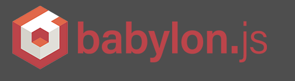
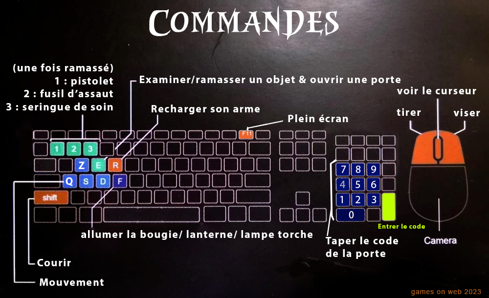
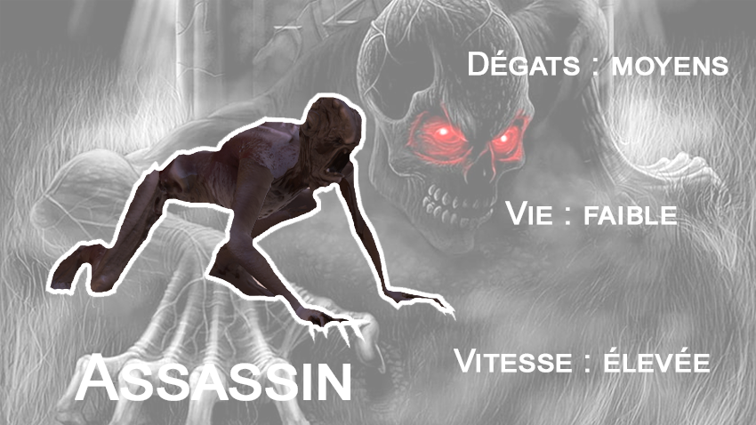
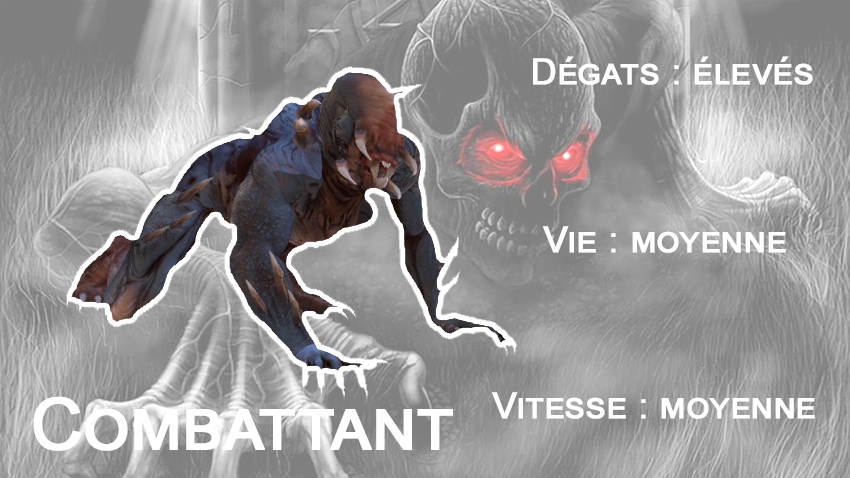
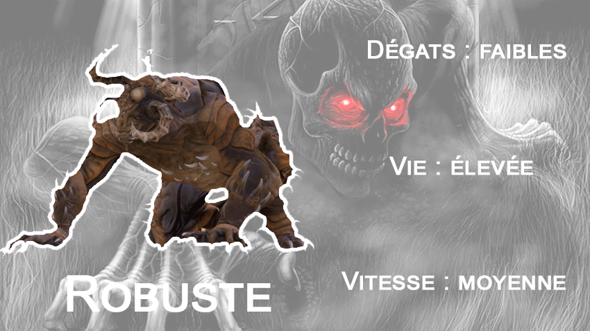
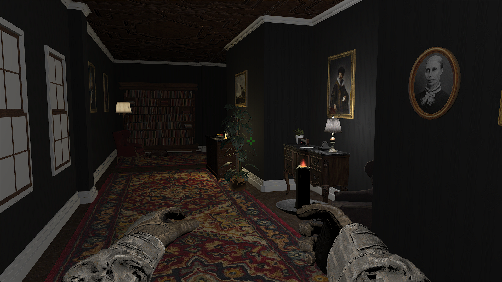
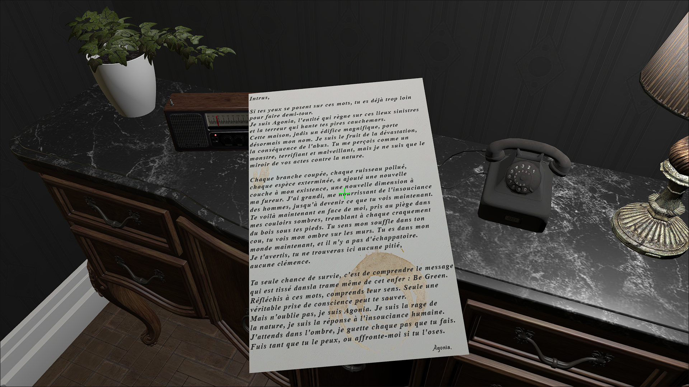
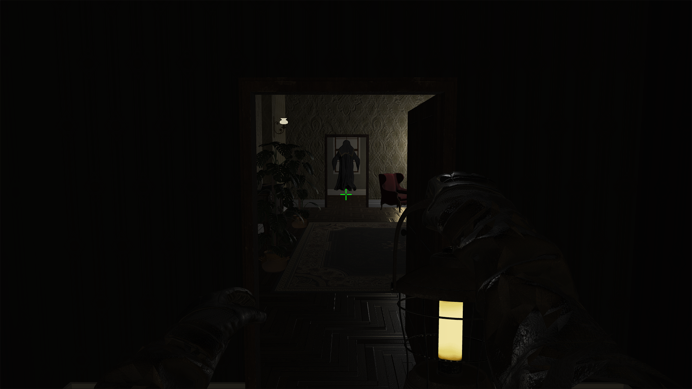
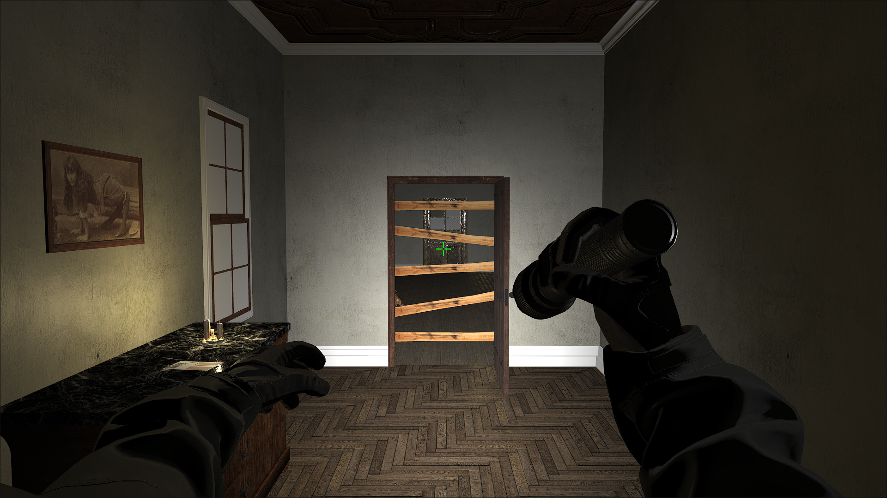
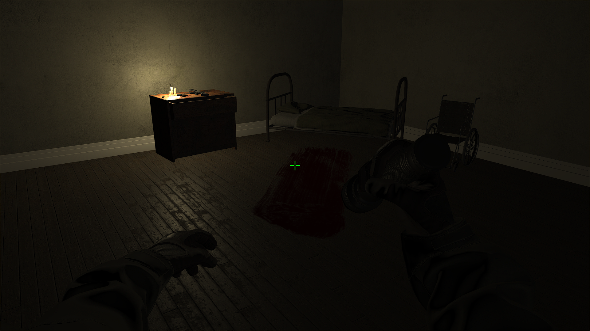

<!-- PROJECT LOGO -->
<br />
<div align="center">
  <a href="https://begreenagonia.herokuapp.com/">
    
  </a>

  <h1 align="center">Agonia 🌿</h1>

  <p align="center">
    Be green Games on web 2023
    <br />
    <a href="https://www.youtube.com/watch?v=1c3iP3AXuo0"><strong>Vidéo démo 🎬»</strong></a>
    <br />
    <br />
    <a href="https://begreenagonia.herokuapp.com/">🎮Tester le jeu</a>
    ·
    <a href="https://github.com/AgoniaMIAGE/Agonia/issues">🐛Report Bug</a>
    ·
    <a href="https://github.com/AgoniaMIAGE/Agonia/issues">🌟Request Feature</a>
  </p>
</div>


<!-- TABLE OF CONTENTS -->
<details>
  <summary>Table des matières📚</summary>
  <ol>
    <li>
      <a href="#about-the-project">Histoire d'Agonia📖</a>
      <ul>
        <li><a href="#built-with">Développé à l'aide de 🛠️:</a></li>
      </ul>
    </li>
    <li>
      <a href="#getting-started">Pour Commencer🚀</a>
      <ul>
        <li><a href="#prerequisites">Prérequis</a></li>
        <li><a href="#installation">Installation💻</a></li>
      </ul>
    </li>
    <li><a href="#usage">Utilisation🎮</a></li>
    <li><a href="#roadmap">Contrôles🕹️</a></li>
    <li><a href="#contributing">Monstres🐉</a></li>
    <li><a href="#license">Quelques Spoils📸</a></li>
    <li><a href="#contact">Contact📧</a></li>
  </ol>
</details>


## Histoire d'Agonia📖

<br>


Cher Explorateur d'Agonia,

Je vous souhaite la bienvenue dans l'immensité tourmentée d'Agonia, une quête interactive qui transcende le cadre du simple divertissement, pour s'établir en tant que miroir réfléchissant de la réalité apocalyptique qui pourrait être la nôtre.

Vous voici immergé dans un univers dystopique, où la sérénité et la vitalité d'antan ont été supplantées par la dévastation et la dépravation. Jadis symboles de sérénité et de vie, les espaces verts sont à présent des champs de désolation, des marées d'ombre et de détresse, un écho perpétuel de l'agonie de notre Terre-Mère.

En foulant les chemins sinueux de ce royaume désolé, vos yeux seront témoins d'une nature corrompue. Les arbres, jadis les majestueux gardiens de la vie, sont désormais des spectres décharnés, aux écorces rongées par la maladie et la pollution. Ils se tiennent, silencieuses sentinelles de notre indifférence, métaphores vivantes des forêts massacrées, des habitats anéantis et des espèces poussées à l'extinction par notre inaction face à la mutation climatique.

Le protagoniste spectral qui hantera vos pas n'est autre que le monstrueux rejeton de nos propres terreurs et angoisses, engendré par les catastrophes écologiques qui nous guettent. Cette abomination n'est pas le fruit de superstitions ou de fantasmes, mais une incarnation palpable de l'éco-anxiété collective, cette peur grandissante face à l'avenir incertain qui nous attend. Ce monstre est l'incarnation manifeste des retombées néfastes de nos actions : pollution de l'air et des océans, extinction en masse des espèces et le réchauffement planétaire qui nous menace tous.

Agonia n'est pas simplement un jeu. C'est une épopée qui vous transporte dans un futur dystopique, une parabole du réchauffement et de la pollution climatique. En éliminant les monstres, vous exterminerez symboliquement les méfaits qui découlent de notre négligence environnementale. Leur trépas représente la rédemption, la destruction de nos actions néfastes pour une renaissance de notre relation avec l'environnement.

Approchez-vous de ce royaume d'agonie avec une résolution inébranlable, car n'oubliez pas : ce n'est pas qu'une illusion numérique, c'est un cri d'alarme. L'heure est venue d'agir, pour empêcher que ce cauchemar ne devienne notre réalité.

<br>
<br>


### Développé à l'aide de 🛠️ :


* 
* ![Node.js][Node.js]
* ![TypeScript][TypeScript]
* 
* 
* 
* 
* 


<br>
<br>


## Pour commencer 🚀

<br>

Voici un exemple de la façon dont vous pouvez donner des instructions pour configurer votre projet localement.
Pour obtenir une copie locale et la faire fonctionner, suivez ces simples étapes.

### Prérequis
Voici les éléments dont vous avez besoin pour utiliser le logiciel et comment les installer, il faut commencer par installer node.js.
Veuillez ensuite installer le jeu en le téléchargeant à
partir de ce repository : https://github.com/AgoniaMIAGE/Agonia
ou en le clonant comme ci-dessous.

*
   ```sh
   git clone https://github.com/AgoniaMIAGE/Agonia.git
   ```

### Installation 💻

1. installez à présent npm dans le repository où vous avez mis les fichiers du projet

*
  ```sh
  npm install npm@latest -g
  ```
2. Installez Babylonjs
*
   ```sh
   npm install babylonjs --save
   ```
à partir de la, la configuration devrait être prête, s'il manque
une ou deux library pour X raison vous pouvez toujours l'installer

<br>
<br>


## Utilisation 🎮

Pour lancer le jeu, il faudra exécuter cette commande dans le terminal

*
```sh
  npm run build
  ```
Puis celle-là

*
```sh
  npm run start
  ```
Vous pourrez aller à l'adresse suivante et jouer au jeu :http://localhost:8080/


## Contrôles 🕹️

<br>
<br>





<br>
<br>
<br>


## Monstres 🐉

<br>
<br>

### ***Assassin***


<br>

### ***Combattant***


<br>

### ***Robuste***



<br><br>
<br>
<br>
<br>


## Quelques Spoils 📸



<br>




<br>



<br>



<br>



<!-- CONTACT -->
## Contact 📧

Adem BenJabria - Adem.bj@gmail.com
[![LinkedIn][linkedin-shield]][linkedin-url]

Valentin Charles - valentincharles16@gmail.com
[![LinkedIn][linkedin-shield]][linkedin-url2]

<br>

Merci d'avoir porté attention à notre projet ! 👍


<!-- MARKDOWN LINKS & IMAGES -->
<!-- https://www.markdownguide.org/basic-syntax/#reference-style-links -->

[contributors-shield]: https://img.shields.io/github/contributors/othneildrew/Best-README-Template.svg?style=for-the-badge
[contributors-url]: https://github.com/othneildrew/Best-README-Template/graphs/contributors
[forks-shield]: https://img.shields.io/github/forks/othneildrew/Best-README-Template.svg?style=for-the-badge
[forks-url]: https://github.com/othneildrew/Best-README-Template/network/members
[stars-shield]: https://img.shields.io/github/stars/othneildrew/Best-README-Template.svg?style=for-the-badge
[stars-url]: https://github.com/othneildrew/Best-README-Template/stargazers
[issues-shield]: https://img.shields.io/github/issues/othneildrew/Best-README-Template.svg?style=for-the-badge
[issues-url]: https://github.com/othneildrew/Best-README-Template/issues
[license-shield]: https://img.shields.io/github/license/othneildrew/Best-README-Template.svg?style=for-the-badge
[license-url]: https://github.com/othneildrew/Best-README-Template/blob/master/LICENSE.txt
[linkedin-shield]: https://img.shields.io/badge/-LinkedIn-black.svg?style=for-the-badge&logo=linkedin&colorB=555
[linkedin-url]: https://www.linkedin.com/in/adem-ben-jabria-532395221/
[linkedin-url2]: https://www.linkedin.com/in/valentin-charles-9264531b7/
[product-screenshot]: images/screenshot.png
[Node.js]: https://img.shields.io/badge/Node.js-43853D?style=for-the-badge&logo=node.js&logoColor=white
[Node-url]: https://nodejs.org/
[TypeScript]: https://img.shields.io/badge/TypeScript-3178C6?style=for-the-badge&logo=typescript&logoColor=white
[TypeScript-url]: https://www.typescriptlang.org/
[AdobePremierePro-url]: https://www.adobe.com/fr/products/premiere/landpb.html?gclid=CjwKCAjwpuajBhBpEiwA_ZtfheMObLBs9Q4Vnxg6geNdVowGD85T5CcSFGh4cMJ_Bbj0lxPBGRWlURoCEUIQAvD_BwE&mv=search&mv=search&sdid=LQLZT7BT&ef_id=CjwKCAjwpuajBhBpEiwA_ZtfheMObLBs9Q4Vnxg6geNdVowGD85T5CcSFGh4cMJ_Bbj0lxPBGRWlURoCEUIQAvD_BwE:G:s&s_kwcid=AL!3085!3!341240727116!e!!g!!premier%20pro!1435912308!56537471939&gad=1